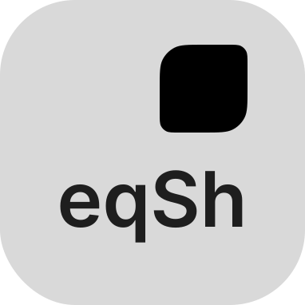

# eqSh
<p align="center">
  <i>“Sometimes less is more, when it's built right.”</i>
</p>

---


<p align="center">
	
</p>
<div align="center">

[](https://github.com/eq-desktop/eqsh/stargazers)
[](https://hyprland.org/)
[]()
[](https://hyprland.org/)
</div>


  

---

<table align="center">
  <tr>
    <td><a href="https://eqsh-wiki.github.io/install">Install</a></td>
    <td><a href="https://github.com/eq-desktop/eqSh/issues">Issues</a></td>
	<td><a href="https://eqsh-wiki.github.io/">Wiki</a></td>
  </tr>
</table>


---

**eqSh** is the next-generation shell for [Hyprland](https://github.com/hyprwm/Hyprland) —  
a polished, Apple-inspired Linux environment for both **superusers** and **everyday users**.  

It’s more than a bar. eqSh is your **panel, notch, launcher, notifications hub, lockscreen, wallpaper engine, tray, and more** — all in one.

---

## Preview


<details>
<summary>
<b>More Screenshots</b>
</summary>


</details>

---

## 🚀 Quickstart

<h3><a href="https://eqsh-wiki.github.io/"><b>Wiki</b></a></h3>

<a name="install-guide">Install Guide</a>

<details>
<summary>
<b>1. Install Quickshell</b>
</summary>

<details>
<summary>Arch</summary>

```bash
yay -S quickshell
```

</details>
<details>
<summary>NixOS</summary>

```
{
	inputs = {  
		nixpkgs.url = "nixpkgs/nixos-unstable";  

		quickshell = {
			url = "git+https://git.outfoxxed.me/outfoxxed/quickshell";
			inputs.nixpkgs.follows = "nixpkgs";
		};
	};
}
```

</details>
<details>
<summary>Fedora</summary>

```bash
sudo dnf copr enable errornointernet/quickshell
sudo dnf install quickshell
```

</details>
<details>
<summary>Guix</summary>

```bash
guix install quickshell
```

</details>
</details>

<details>
<summary>
<b>2. Install using CLI</b>
</summary>

```bash
pip install git+https://github.com/eq-desktop/cli.git
equora install
```

</details>

<details>
<summary>
<b>2. Clone git repository (Old way of installing)</b>
</summary>

```bash
mkdir ~/eqSh
mkdir ~/.config/quickshell
git clone https://github.com/eq-desktop/eqSh ~/eqSh
git submodule update --init --recursive
mv ~/eqSh/eqsh ~/.config/quickshell/
```

For wallpapers do:

```bash
git clone https://github.com/eq-desktop/wallpapers.git ~/eqSh/wallpapers
```

</details>

<details>
<summary>
<b>3. Start eqSh</b>
</summary>

```bash
equora run
```

Or make it permanent by adding this to `~/.config/hypr/hyprland.conf`:

```bash
exec-once = equora run
```

</details>

<details>
<summary>
<b>4. Post-Install</b>
</summary>

Icon theme: [MacTahoe Icon Theme](https://github.com/vinceliuice/MacTahoe-icon-theme)

GTK theme: [MacTahoe GTK Theme](https://github.com/vinceliuice/MacTahoe-gtk-theme)

Hyprland Config: [Hyprland Config](https://github.com/eq-desktop/hyprland-config)

</details>

---

## Configuration

<details>
<summary>
<b>1. Keybinds</b>
</summary>

To assign eqsh actions to keybinds you can use this format

```bash
bind = mod, key, global, eqsh: action_name
```

EqSh is designed to be used with a keyboard, which is why it has a lot of actions:

- widgets: Toggles Widget Edit Mode
- sigrid: Toggles Sigrid AI Assistant
- launchpad: Toggles Launchpad
- lock: Locks the screen
- unlock: Unlocks the screen (Not recommended)
- toggleNotchActiveInstance: Toggles the Notchs active instance, opening or closing it
- toggleNotchInfo: Toggles the Notchs info panel (not implemented yet)
- notificationCenter: Toggles the Notification Center
- notificationCenterOpen: Opens the Notification Center
- notificationCenterClose: Closes the Notification Center
- controlCenterBluetooth: Opens the Bluetooth Menu
- controlCenter: Opens the Control Center
- screenshot: Opens the Screenshot Menu
- screenshotRegion: Opens the Screenshot Region Selector
- screenshotEntireScreen: Takes a screenshot of the entire screen
- settings: Opens the Settings
- spotlight: Opens the Spotlight


</details>

---

## ✨ Features

- [x] Top Panel  
- [x] Notch  
- [x] Notch Applications  
- [x] Notifications  
- [x] Modals with IPC integration
- [x] App Drawer / Launchpad 
- [x] Lockscreen  
- [x] Wallpaper Engine  
- [x] System Tray  
- [x] Battery & WiFi Indicators  
- [x] Clock  
- [x] On-Screen-Displays for Volume and Brightness
- [x] Polkit  
- [x] Control Center  
- [x] Dock  
- [x] Sigrid AI Chatbot  
- [x] Desktop Widgets  
- [x] Screenshot tool  
- [x] Full JSON user settings & Settings App
- [x] Control Center  
- [x] Advanced IPC-powered popup system

---

## 🛠 Coming Soon

* Dock with magnification
* Global Menu
* Desktop Files
* Spotlight Extensions
* Custom dropdown menus

---

## 📖 Documentation

👉 Full docs & guides: [Wiki](https://eqsh-wiki.github.io/)

---

## ⚖️ License

This project is released under the **APACHE-2.0 License**.  
You are free to use, modify, and distribute — but all changes must remain open-source.
